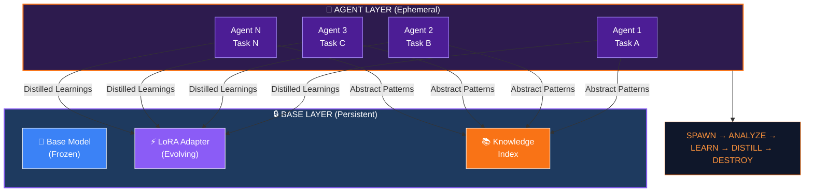
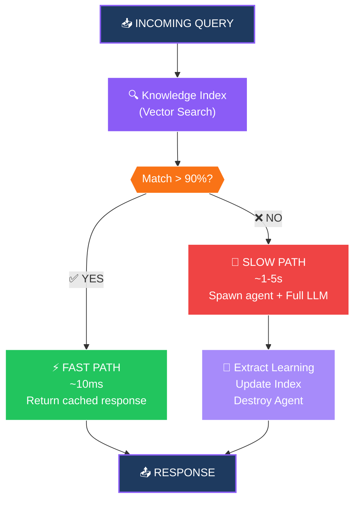
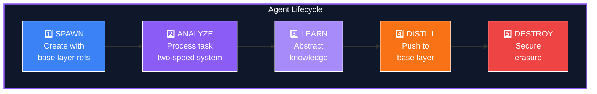
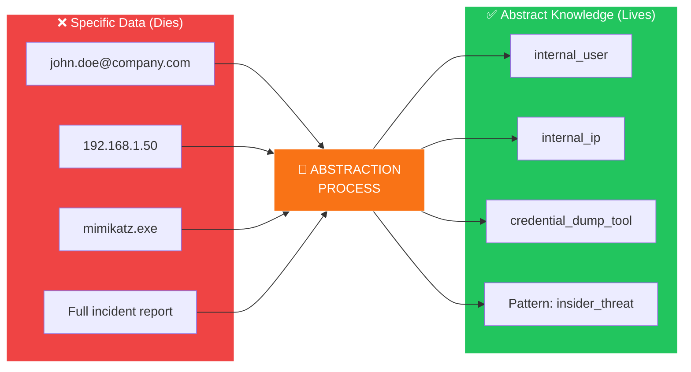
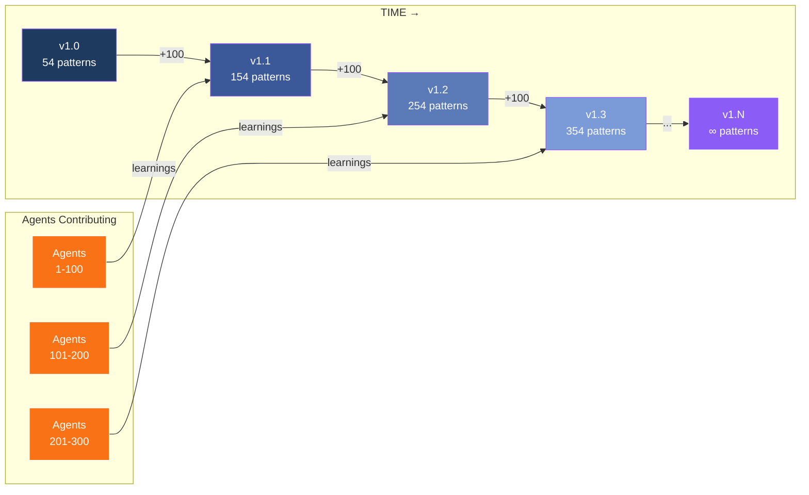
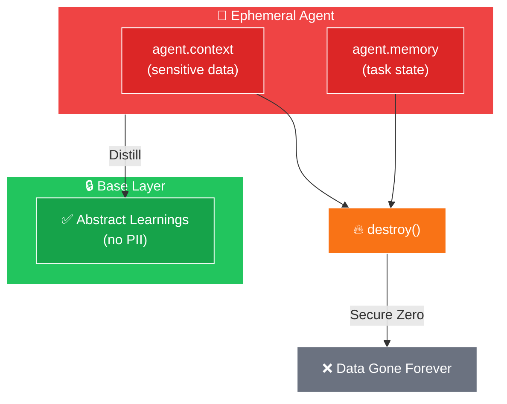

# ERLA Whitepaper Diagrams

These diagrams are designed to be rendered with Mermaid and exported as SVG/PNG for the whitepaper.

---

## Diagram 1: ERLA Architecture Overview



---

## Diagram 2: Two-Speed Response System



---

## Diagram 3: Ephemeral Agent Lifecycle



---

## Diagram 4: Knowledge Abstraction Process



---

## Diagram 5: Recursive Improvement Over Time



---

## Diagram 6: Privacy Properties



---

## How to Export

1. **Mermaid Live Editor**: https://mermaid.live
   - Paste each diagram code
   - Export as SVG or PNG

2. **VS Code Extension**: "Markdown Preview Mermaid Support"
   - Preview and export directly

3. **CLI Tool**: `mmdc` (mermaid-cli)
   ```bash
   npm install -g @mermaid-js/mermaid-cli
   mmdc -i diagrams.md -o diagram.svg
   ```

---

## Color Palette Used

| Color | Hex | Usage |
|-------|-----|-------|
| Purple | `#8b5cf6` | Primary accent, headers |
| Purple Light | `#a78bfa` | Secondary elements |
| Dark Blue | `#1e3a5f` | Backgrounds, base layer |
| Orange | `#f97316` | Tertiary accent, highlights |
| Green | `#22c55e` | Success, safe data |
| Red | `#ef4444` | Danger, ephemeral data |

